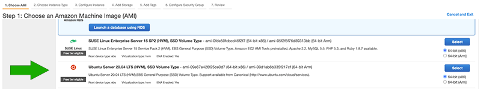
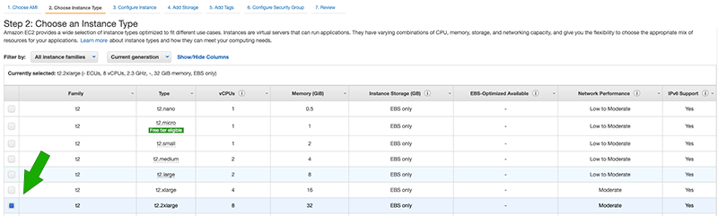
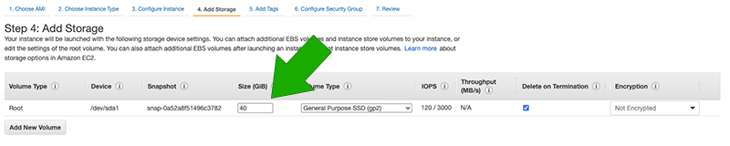
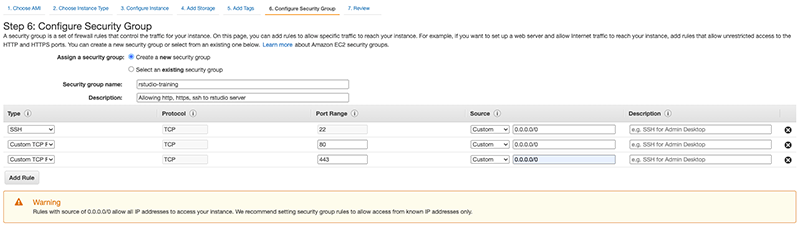
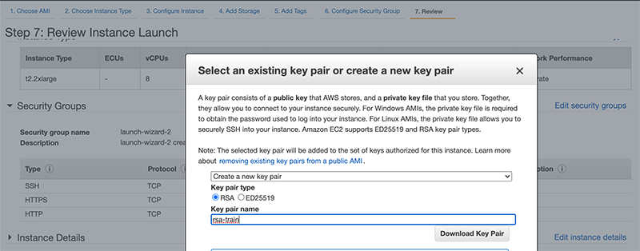
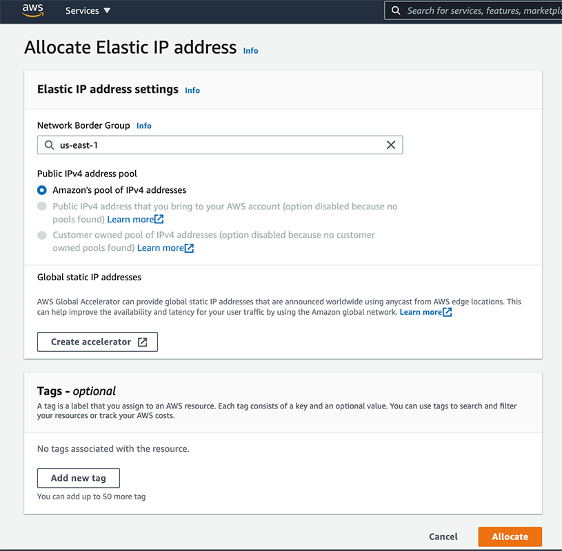
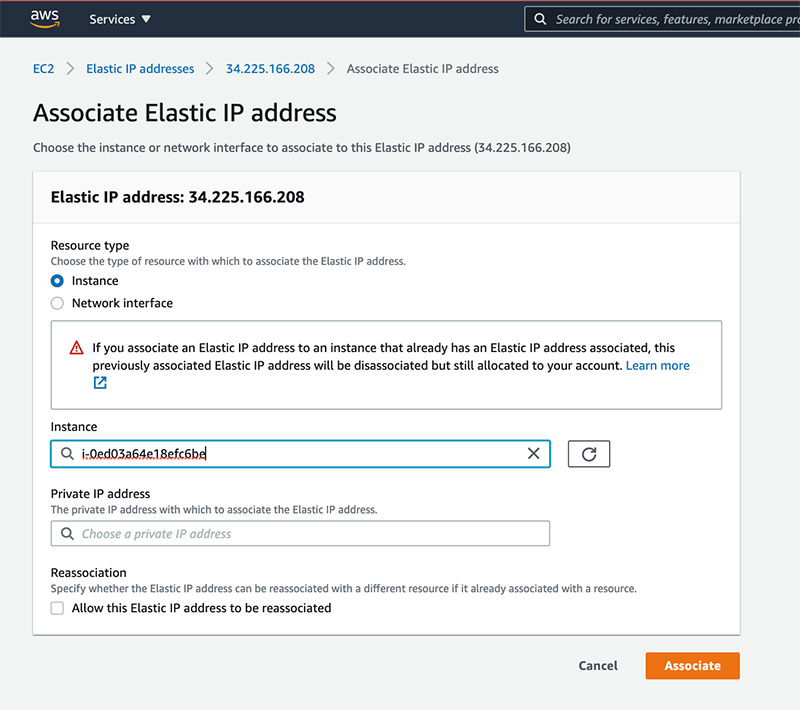
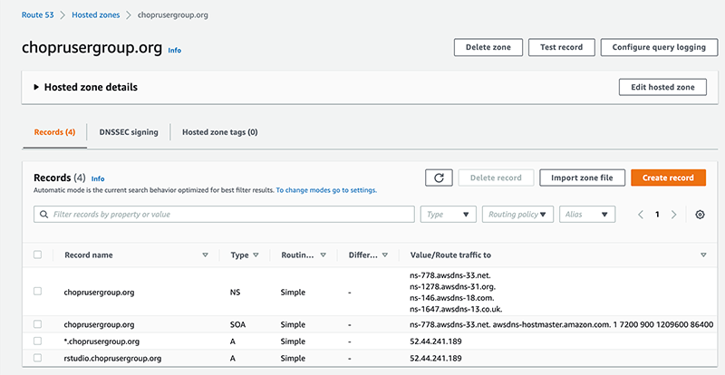

# RStudio Server Pro Training Environment

The setup we describe here consists of a VM (virtual machine) in AWS (Amazon Web Services) that hosts a containerized (Docker container) implementation of RStudio Server Pro.  In this document, you might see "VM", "instance", "server", or "machine", all of which refer to the same reality -- a virtual machine created in the EC2 service of AWS.

The steps here walk you through obtaining and setting an appropriately sized VM, installing a Docker image, setting up the administrative parts of RStudio Server Pro (the license and users), and ensuring that users of your training instance can connect to your server which will hand off requests to the Docker container.  Much of the nitty-gritty is handled by scripts contained in this directory.

## Part 1:  Obtain a VM on Amazon Web Services Elastic Compute Cloud (AWS EC2)

In this step we presume you are a CHOP user with account privileges on AWS.  To log in to your CHOP AWS account, first go to https://myapplications.microsoft.com/ and then choose "AWS" (may be in a separate tab labeled "Apps").  Then go into the management console and begin work!

Amazon's EC2 service allows you to create VMs, and that's what we'll use here.  At the time of writing, the EC2 instance (EC2 instance = VM) creation has several discrete steps listed at the top of the web pages AWS presents when instances are created:

1. Choose AMI
2. Choose Instance Type
3. Configure Instance
4. Add Storage
5. Add Tags
6. Configure Security Group
7. Review

We'll go through each of these steps.

### Step 1: Choose AMI

Create an EC2 instance with the Ubuntu 20.04 LTS AMI.  You'll need to search for EC2 in the search box to get to the right page, unless it's in your recently accessed services.  Or try this link: https://console.aws.amazon.com/ec2/ and choose "Launch Instance" to get into the AMI picker.




### Step 2: Choose Instance Type

Instance Type here really means machine size in terms of CPUs/Cores and RAM.  For testing, the "free tier eligible" `t2.micro` machine (1 GB, 1 core) works well.  For recent iterations of R for Clinical Data given in fall 2021, a `t2.2xlarge` (8 cores, 32G of RAM) worked quite well for 50 or so participants.  Note that later we will add more space to disk.



### Step 3: Configure Instance

Unless you have special requirements, you can leave the defaults here unchanged.

### Step 4: Add Storage

Adding more disk here may be helpful.  There's no strict rule of thumb here and a lot depends on what you're doing and expect to have stored on disk.  For recent iterations of R for Clinical Data given in fall 2021, we added to the root disk, expanding it to 40G.  See below how we expanded the value.



### Step 5: Add Tags

Unless you have special requirements, you don't need to add tags here.

### Step 6: Configure Security Group

If you already have a security group that allows public ingress to ports 22, 80, and 443, you can use that.  Or, if you don't, or don't know, you can create a new one.  Name it something descriptive and add a description that will capture the intent of the security group --  a set of rules allowing access to SSH, HTTP, and HTTPS.

In addition to allowing inbound SSH (port 22), you want to allow inbound HTTP and HTTPS traffic (ports 80 and 443).  While it's usually a good idea to limit SSH access to the IP address or range of machine administrators, since this is a short-lived training instance, it's fine to use the 0.0.0.0/0 (all IP addresses) CIDR block for all three ingress rules.  To add new rules, choose "Add Rule" twice and add port numbers 80 and 443 and the CIDR block 0.0.0.0/0.



### Step 7: Review

If you're happy with what you've done so far you don't have to change anything in the first screen you see.  Click "Launch Instance" and you'll be prompted to make some decisions related to key pairs.

Key pairs are important, because you've said anyone can try to SSH in (log in to the server to administer it) from any IP address.  So that means you have to make sure that SSH is secured somehow, to prevent internet-scanning bots from realizing your server is fair game to install their cryptocurrency miners or other detrimental software.  You do this by generating a key pair.  The public key stays on the server, and you download the private key to a safe place.  Only people who use the private key (which you downloaded) can get into the server to run commands using SSH.

You can name your key pair what you want, but later in the instructions we assume you named it `rsp-train`.  Make sure you download the private key and know where you downloaded it to!  The "Launch Instances" button here won't become active until you download your key file.



## Part 2:  Improve connectivity

Currently, your VM has an IP address that you can use to reach it, but this IP address will change every time you stop the machine (which also stops billing).  

### Step 1: Acquire an Elastic IP

To avoid the hassle of keeping track of the instance IP address every time you shut down and restart your server, you should choose to allocate an "Elastic IP" address (a small number come free with every AWS account).  Read [the AWS documentation](https://aws.amazon.com/premiumsupport/knowledge-center/ec2-associate-static-public-ip/) for more details.

To allocate an Elastic IP, find the **Network & Security** section and **Elastic IPs** item below that in the navigation pane of your EC2 dashboard or go directly to [the "Allocate Elastic IP address" page](https://console.aws.amazon.com/ec2/v2/home#AllocateAddress). Click the button marked "Allocate Elastic IP Address".

Choose from Amazon's pool of addresses and leave everything else as the default.  Then click "Allocate".



### Step 2: Associate Elastic IP With Instance

Once the address is *allocated*, you want to *associate* it with your instance.  Click on the newly allocated IP address and choose "Associate".  In the instance drop down list, choose your instance name and click "Associate".



Once you've gotten your Elastic IP allocated and associated, keep track of it, because you're going to point your domain name to that IP address.

### Step 3: Set Up Domain

You'll also want a domain name associated with your server, and, in order to use https:// instead of just http://, an SSL certificate.

#### Historical Background...

Joy purchased the domain name in 2021, but here's some details about how to purchase one:

To create a domain name, consider domain registration using the [AWS Route 53 service](https://console.aws.amazon.com/route53/home#DomainRegistration).  It's not a requirement to do that here, as you can get domain names in many places, but it's nice to have everything together in AWS.  Domains cost anywhere from $9 and up, depending on what you choose.

    Note: register your domain early. It may take up to 3 days for the domain registration to be processed.

Joy also had to transfer the domain from her personal AWS to her CHOP AWS.  She used the documentation here: https://docs.aws.amazon.com/Route53/latest/DeveloperGuide/domain-transfer-between-aws-accounts.html

#### OK, Back to the Present....

Create a ["hosted zone" in Route 53](https://console.aws.amazon.com/route53/v2/hostedzones#) for your domain name. (If you just registered the domain name in Route 53, Route 53 will have created a hosted zone for you). Within the hosted zone, create a new DNS record (record type **A**) that points the host name to the IP of your EC2 instance -- the Elastic IP address you allocated and associated with your VM.

Here, you can see that while we've routed any subdomain (the part before the domain name, which for many sites is "www") to our IP address, we've also explicitly included the "rstudio" subdomain, which is what we'd like to use as the URL for our students.  The NS and SOA records came pre-added for us and we didn't have to add those records.



## Part 3: Work Inside the VM

The next steps you need to do to set up your server must be done within the server.  That means SSH-ing in, which is why you saved that .pem file (the private key) and remember where that file is.

### Step 1: Log in

Using Terminal (on Mac) or a terminal emulator like PuTTY on Windows, log into the instance, using your private key.  Note that the instance must be running for you to be able to log in!

For example, in Mac, you can use the following command, substituting <your_server> for either the public IPv4 address or the domain name of the server and including the path to your downloaded key.

```bash
ssh -i path/to/rsp-train.pem ubuntu@<your_server>
```

Enter "yes" if asked if you want to connect. If you get a warning about an unprotected privae key file, change permissions to user read-only by running `chmod 400 path/to/rsp-train.pem`.

Once you're logged in, you will be able to execute commands on the instance.  The next steps will be just that -- code that is run within your SSH session, executing instructions on the EC2 instance.

### Step 2: Update Software and Set up Firewall

Update packages on the instance and set up a firewall with these commands:

```bash
sudo apt update

sudo ufw allow OpenSSH
sudo ufw enable
```

### Step 3: Set up Web Server

Install Nginx on the instance and configure reverse proxy with HTTPS redirect with a TLS/SSL certificate from [Letsencrypt](https://letsencrypt.org/).  

In this and further chunks of command line entries, please do just one line at a time (not copy-paste blocks).  This will allow you to answer any questions along the way with Y (please, yes, do the thing).

```bash
sudo apt install nginx
sudo ufw allow 'Nginx Full'
sudo systemctl start nginx
sudo systemctl enable nginx
```

Check that the instance is accessible from http://<instance> (use a domain name or the IP address to replace <instance>).  Note that we're currently using http, NOT https.  The next step is setting that up!

[Letsencrypt](https://letsencrypt.org/) is a free service for short-term use of SSL certs, which is great since usually SSL certs are a bit pricey.

Substitute `<your_domain>` with the desired domain name and run the following code on your instance:

```bash
sudo snap install --classic certbot
sudo ln -s /snap/bin/certbot /usr/bin/certbot
sudo certbot --nginx -d <your_domain>
```

Enter your information when prompted.

If this worked successfully, then anyone who connects to http://<instance> will be automatically redirected to a secure HTTPS connection (https://<instance>), and the TLS certificate should be valid.  Give that a try to make sure everything is working and that https:// is functioning as expected, by going to your domain in your favorite web browser.

### Step 4: Set up Docker

Docker is a containerization solution that allows you to quickly deploy applications.  Begin by making sure your instance is set up to use Docker by running the following code on your instance.

```bash
sudo apt update
sudo apt install apt-transport-https ca-certificates curl gnupg lsb-release

curl -fsSL https://download.docker.com/linux/ubuntu/gpg | sudo gpg --dearmor -o /usr/share/keyrings/docker-archive-keyring.gpg

echo \
  "deb [arch=amd64 signed-by=/usr/share/keyrings/docker-archive-keyring.gpg] https://download.docker.com/linux/ubuntu \
  $(lsb_release -cs) stable" | sudo tee /etc/apt/sources.list.d/docker.list > /dev/null

sudo apt update
sudo apt install docker-ce docker-ce-cli containerd.io
```

### Step 5: Get and Install Docker container

Which Docker container do we want?  A variation on the RStudio Server Professional container.  To run professional, you need a license (for training purposes you can reach out to RStudio to ask for this).  

#### About the Docker Image

The Docker image we use for an Intro to R training environment using RStudio Server Pro is based on [rstudio/rstudio-server-pro](https://hub.docker.com/r/rstudio/rstudio-server-pro). Yep, even though the branding has changed to RStudio Workbench, the container still goes by the old name.  This automatically generates a configurable number (up to 999) of accounts, which can be useful for Intro to R courses.

##### Features

The `Dockerfile` in this repository extends [rstudio/rstudio-server-pro](https://hub.docker.com/r/rstudio/rstudio-server-pro) by adding:

- The `libxml2-dev`, `vim`, and `git` packages
- The `tidyverse`, `rmarkdown`, and `devtools` R packages

In addition, the [startup script](start_rsp_train.sh) accomplishes the following within the Docker container:

- Clones a GitHub repository with course materials.
  - Repos must contain two folders labeled `exercises` and `solutions`.
  - For an example repo, see <https://github.com/skadauke/intro-to-r-for-clinicians-rmed2020>.
- Creates a configurable number of users with a configurable prefix, e.g. `train001`, `train002`, ... or `rmed001`, `rmed002`, ...
  - Passwords are random 6-digit numbers. The seed for random password generation is passed at the time `docker run` is invoked.
  - Course materials are automatically placed inside the home directory of each user. To save space, only `exercises` and `solutions` folders are copied.
- Optionally, installs a list of additional R packages.
  - GitHub R packages are supported.
- Automatically activates and deactivates the supplied RStudio Server Pro license when the docker container is started or stopped.

##### Configuration

An aside: Note that running the RStudio Server Pro Docker image requires the container to run using the `--privileged` flag and a valid RStudio Server Pro license. The image also expects an `/etc/rstudio` folder which customarily is mounted from a local directory named `server-pro/conf`.

#### Install the Docker Image

The following command will start an RStudio Server Pro container (using the Dockerfile at [skadauke/rsp-train](https://hub.docker.com/r/skadauke/rsp-train)).  It will add the `shiny`, `flexdashboard`, and `plotly` packages from CRAN, as well as the GitHub `rstudio/DT` package from GitHub, installed globally. One hundred users will be created, named `ruser001`, `ruser002`, ... `ruser100`. Each user's home directory will have a copy of the `exercises` and `solutions` folders from the `skadauke/intro-to-r-for-clinicians-chop` GitHub repository, as well as a folder titled `backup/` which contains another copy of the `exercises` folder (This comes in handy if the learner accidentally deletes or otherwise changes an exercise file).

In the code below, you'll need to replace some values -- especially these:

* valid license
* new PW_SEED
* useful USER_PREFIX
* applicable GH_REPO

```bash
sudo docker pull skadauke/rwb-train

export RSP_LICENSE=XXXX-XXXX-XXXX-XXXX-XXXX-XXXX-XXXX

sudo docker run --privileged -it \
    --detach-keys "ctrl-a" \
    --restart unless-stopped \
    -p 8787:8787 -p 5559:5559 \
    -e USER_PREFIX=ruser \
    -e GH_REPO=https://github.com/arcus/intro-to-r-for-clinicians-chop \
    -e R_PACKAGES=shiny,flexdashboard,plotly,DT,markdown \
    -e N_USERS=100 \
    -e PW_SEED=42 \
    -e RSP_LICENSE=$RSP_LICENSE \
    -v "$PWD/server-pro/conf/":/etc/rstudio \
    -v /run/dbus/system_bus_socket:/run/dbus/system_bus_socket:ro \
    skadauke/rwb-train
```

After the Docker container has started up, press Ctrl+A to detach the image. This will allow you to take back control of the console. The container will continue to run in the background.

### Step 6: Configure Nginx

Next, we will configure Nginx on the instance to forward traffic to the Docker container, where RStudio lives and will handle requests.

Below, substitute `<my_hostname>` with the domain name of your host.

Type `sudo nano /etc/nginx/sites-available/default`.

Inside the `/etc/nginx/sites-available/default` file, use your directional keys to navigate to and your keyboard to replace the following lines, which will appear 2 times (once for **http** or port 80 traffic, in a block near the top, and once for **https** or port 443 traffic, in a block near the bottom).  If you don't replace both you will be frustrated as nginx won't forward inbound requests to the RStudio Docker container appropriately.

```conf
location / {
        # First attempt to serve request as file, then
        # as directory, then fall back to displaying a 404.
        try_files $uri $uri/ =404;
}
```

With the following:

```conf
location / {
    proxy_pass http://localhost:8787;
    proxy_http_version 1.1;
    proxy_read_timeout 20d;
}
```

Also change (only in the https section toward the bottom)
```
server_name _;
```

to

```
server_name <my_hostname>;
```


Save the updated file and exit using the keyboard commands shown in your screen for nano (Ctrl X and Enter, for example).

Again using nano, type `sudo nano /etc/nginx/nginx.conf`.

Add the following lines right after `http {` in `/etc/nginx/nginx.conf`:

```conf
        map $http_upgrade $connection_upgrade {
            default upgrade;
            ''      close;
        }

        server_names_hash_bucket_size 64;
```

Save and exit the file.

Test the configuration and restart Nginx:

```bash
sudo nginx -t
sudo systemctl restart nginx
```

### Troubleshooting and Extras

#### Improved Docker Image

Did you update the Dockerfile for your own use case?  Push the image to Docker Hub, substituting your Docker Hub username for `<your_username>`:

```bash
docker build <your_username>/rsp-train .
docker push <your_username>/rsp-train
```

#### Fix Licensing Problems

Manually deactivating the license for any lingering uses that didn't deactivate before ending`: http://apps.rstudio.com/deactivate-license/

#### List usernames and passwords

The `create_users_table.R` script is used by the startup script to generate users and can be invoked to create a list of usernames and passwords.

```asis
Usage: ./create_users_table.R <user_prefix> <n_users> <pw_seed> <filename>
```

For example, to create the list of 100 users with the same seed as in the `docker run` command above, type:

```bash
./create_users_table.R train 100 12345 users.txt
```

This generates the file `users.txt` which is a tab delimited file listing usernames and passwords.

#### Teardown

To stop getting charged, you will want to remove the following after you are done:

- EC2 instance
- Hosted zone

#### Expected cost

- Domain name: varies, prices between $10-$50/year are typical
- EC2 instance: it depends on the size and how long you have it up. For a workshop with 30 participants, you might want to use a `a1.4xlarge` instance which costs $0.408 per hour, which comes out to $9.79 per day. To save money, you can first create a small testing instance and then, the day prior to the workshop, replace it with a beefier instance. For multi-day workshops, you can also stop the instance at the end of the day and restart it at the beginning of the next day.
